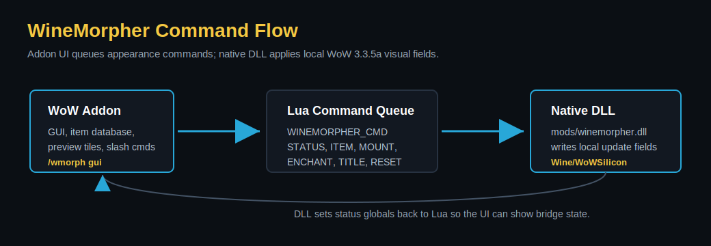
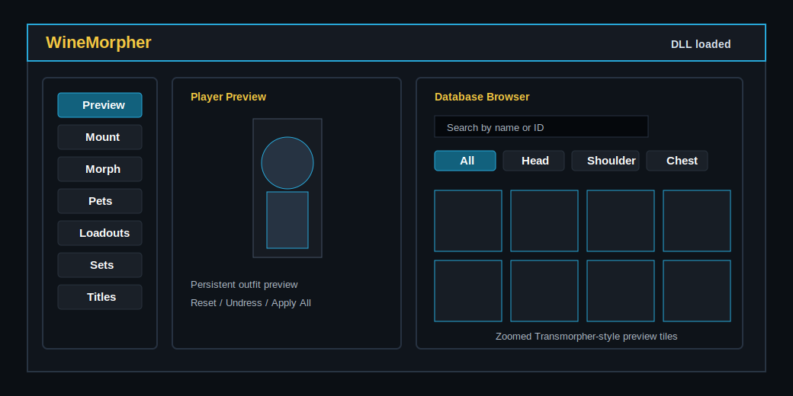

# WineMorpher

WineMorpher is an experimental World of Warcraft 3.3.5a appearance morpher for Wine and WoWSilicon on macOS. It combines a normal WoW addon UI with a small native DLL loaded through `dlls.txt`.

The goal is a Transmorpher-style workflow that works under Wine: preview gear, apply local visual morphs, build outfits, change race/NPC display, morph mounts and pets, apply weapon enchants, adjust scale, and switch titles from one in-game panel.



## Project Status

Working locally:

- WoW 3.3.5a DLL bridge under Wine/WoWSilicon
- `/wmorph` slash command bridge
- In-game GUI
- Player display/race morph
- Scale morph
- Mount morph by display ID
- Gear item morph, hide, reset, and apply-all
- Main-hand and off-hand enchant morph
- Hunter pet morph and pet scale
- Loadout save/load UI
- Sets, titles, mounts, creatures, and item browsers when local data is installed

Still being polished:

- Title behavior across different 3.3.5a clients/servers
- More complete set browsing and class filters
- Better loadout import/export
- Real in-game screenshots and release ZIP packaging
- Stable replacement for mount/NPC model previews, which are unreliable with 3.3.5 `PlayerModel` under this Wine setup

## Data Notice

This public repository ships with safe empty database stubs only.

The local development copy can use large item, preview, creature, set, mount, enchant, pet, and title databases, but some of those were researched from third-party addon data. The reference Transmorpher repository currently has no explicit public license, so those copied data files are not bundled here.

To publish a full database legally, replace the stubs in `addon/WineMorpher_Data/db/` with data you generated yourself, extracted from a licensed source, or have permission to redistribute.

## How It Works

WineMorpher has two parts:

- `addon/WineMorpher`: visible in-game UI, slash commands, preview logic, saved variables, and command queueing.
- `native/winemorpher.dll`: 32-bit native bridge loaded by Wine/WoWSilicon that applies local WoW 3.3.5a visual update-field changes.

The addon writes commands into `WINEMORPHER_CMD`. The DLL polls that Lua global, parses the command, writes the relevant local player/pet fields, and updates status globals for the UI.



## Requirements

- World of Warcraft 3.3.5a Windows client
- Wine/WoWSilicon setup that loads DLLs from `dlls.txt`
- Existing WoWSilicon support DLLs in the game `mods` folder, usually:
  - `mods/libSiliconPatch.dll`
  - `mods/winerosetta.dll`
- Build tools:
  - `make`
  - `clang`
  - `i686-w64-mingw32-gcc`

## Build

```sh
cd native
make
```

Run native command parser tests:

```sh
make test
```

Optional Lua syntax checks:

```sh
npx --yes luaparse addon/WineMorpher/GUI.lua >/dev/null
npx --yes luaparse addon/WineMorpher/WineMorpher.lua >/dev/null
npx --yes luaparse addon/WineMorpher_Data/DataAPI.lua >/dev/null
```

## Install

From the repository root:

```sh
./install.sh "/path/to/world of warcraft 3.3.5a hd"
```

The installer copies:

- `addon/WineMorpher` to `Interface/AddOns/WineMorpher`
- `addon/WineMorpher_Data` to `Interface/AddOns/WineMorpher_Data`
- `native/build/winemorpher.dll` to `mods/winemorpher.dll`

It also writes `dlls.txt`:

```txt
mods/winemorpher.dll
mods/libSiliconPatch.dll
mods/winerosetta.dll
```

After replacing `mods/winemorpher.dll`, fully close WoW/Wine and start the game again. `/reload` is enough only for Lua addon changes.

## Usage

Open the GUI:

```txt
/wmorph
/wmorph gui
```

Useful commands:

```txt
/wmorph status
/wmorph display <displayID>
/wmorph reset
/wmorph mount <displayID>
/wmorph mount reset
/wmorph scale <float>
/wmorph item <slot 1-19> <itemID>
/wmorph item <slot 1-19> hide
/wmorph item <slot 1-19> reset
/wmorph enchant mh <enchantID>
/wmorph enchant oh <enchantID>
/wmorph enchant reset
/wmorph pet <displayID>
/wmorph pet scale <float>
/wmorph pet reset
/wmorph title <titleID>
/wmorph title reset
```

Examples:

```txt
/wmorph display 20578
/wmorph mount 31007
/wmorph scale 1.25
/wmorph item 16 49623
/wmorph enchant mh 3789
/wmorph title 177
```

Common 3.3.5 item slots:

| Slot | Meaning |
| ---: | --- |
| 1 | Head |
| 3 | Shoulder |
| 5 | Chest |
| 6 | Waist |
| 7 | Legs |
| 8 | Feet |
| 9 | Wrist |
| 10 | Hands |
| 15 | Back |
| 16 | Main hand |
| 17 | Off-hand |
| 18 | Ranged |
| 19 | Tabard |

## Roadmap

- Add a release ZIP that contains the built DLL plus addon folders.
- Replace database stubs with a redistributable generated data pipeline.
- Finish title reliability testing on multiple 3.3.5a clients.
- Improve sets with tier/class filters and richer preview behavior.
- Add loadout import/export.
- Add real in-game screenshots after the UI stabilizes.

## Safety

WineMorpher is local visual morphing, not server-side transmog. It is intended for private-server/Wine experimentation. Do not use it on servers where client memory modification is disallowed.

## Credits

WineMorpher is inspired by Kirazul's Transmorpher UI and workflow, and by the WoWSilicon/Wine ecosystem that makes the 3.3.5a client usable on macOS.
