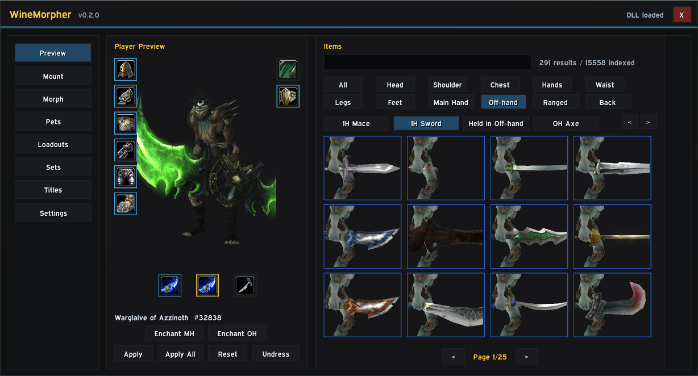
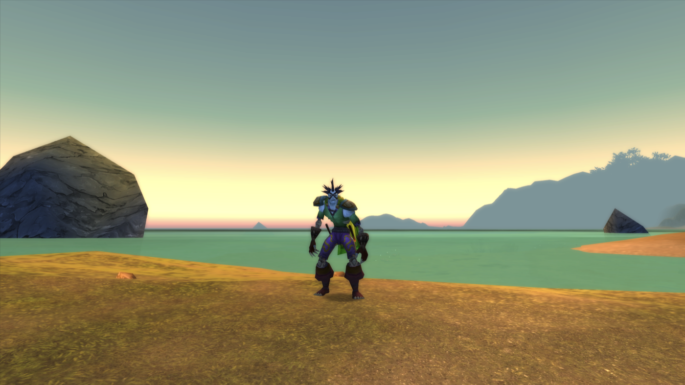
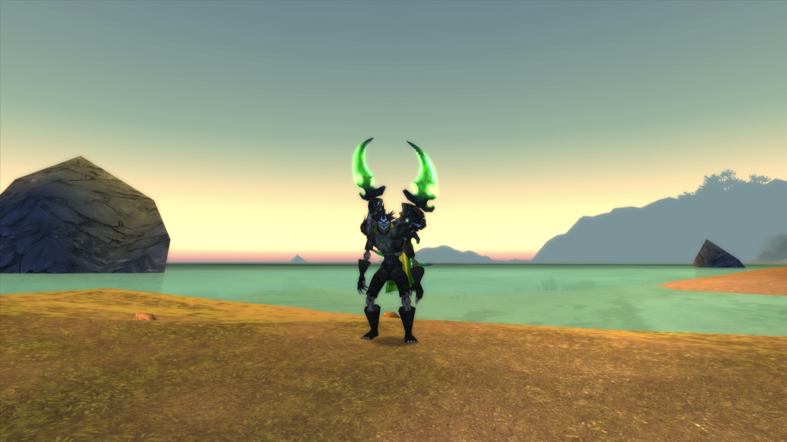
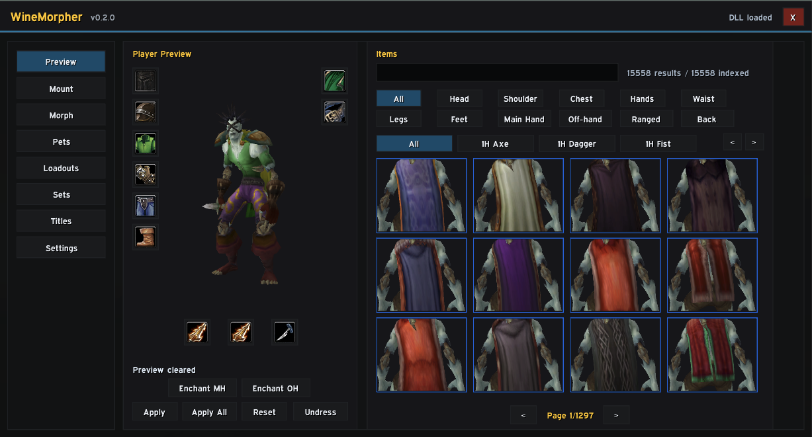
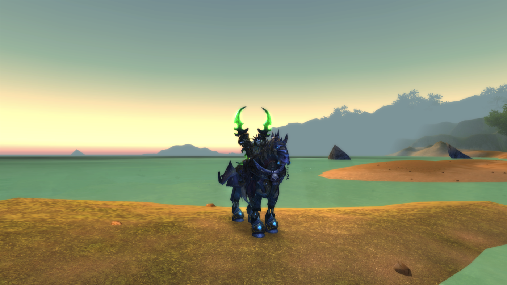
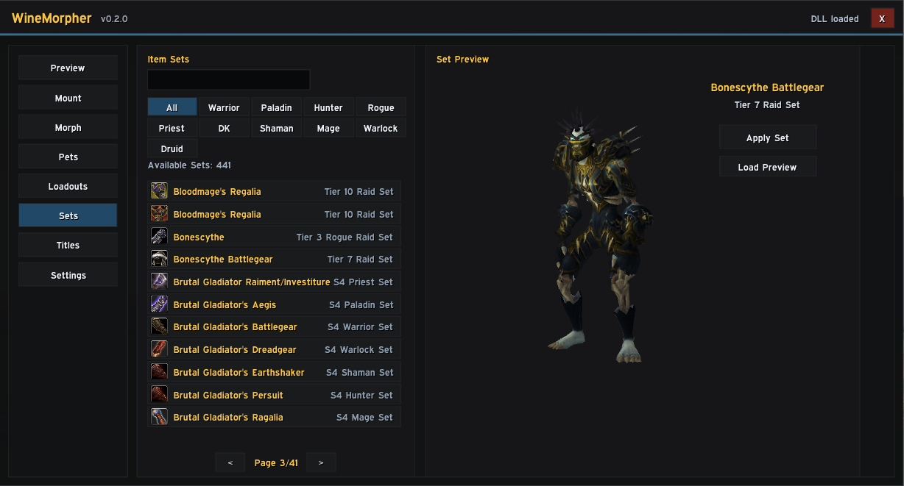

# WineMorpher

<p align="center">
  <a href="https://ko-fi.com/B4D520APT0"></a>
</p>

<p align="center">
  If WineMorpher helped you, you can support development freely through Ko-fi.
</p>

WineMorpher is an experimental World of Warcraft 3.3.5a appearance morpher for Wine and WoWSilicon on macOS.

It has two parts:

- a WoW addon, used for the `/wmorph` GUI and commands
- a 32-bit Windows DLL, loaded by WoWSilicon/Wine from `dlls.txt`



## Screenshots

### In-game morph result

| Before | After |
| --- | --- |
|  |  |

### Preview browser



### Mount morph



### Set preview



## Download

Download the latest `WineMorpher-vX.X.X.zip` from [GitHub Releases](https://github.com/csw48/WineMorpher/releases).

The release ZIP already contains the built DLL. Normal users do not need to run `make`.

## Install

Close WoW completely first.

Copy these folders from the release ZIP:

```txt
Interface/AddOns/WineMorpher
Interface/AddOns/WineMorpher_Data
```

to your WoW folder:

```txt
World of Warcraft 3.3.5a/Interface/AddOns/
```

Copy this file from the release ZIP:

```txt
mods/winemorpher.dll
```

to your WoW folder:

```txt
World of Warcraft 3.3.5a/mods/winemorpher.dll
```

Open or create this file in your WoW folder:

```txt
dlls.txt
```

Make sure it contains:

```txt
mods/winemorpher.dll
mods/libSiliconPatch.dll
mods/winerosetta.dll
```

Start WoW again. In game, type:

```txt
/wmorph
```

or:

```txt
/wmorph gui
```

## Database

The public release includes the `WineMorpher_Data` database files used by the item, preview, mount, creature, set, pet, enchant, and title browsers.

```txt
Interface/AddOns/WineMorpher_Data/db/
```

The database and preview workflow are adapted from Kirazul's Transmorpher project with permission to redistribute the database files in this public GitHub repository and releases. Full credit and thanks to Kirazul.

## What Works

Working in the current build:

- `/wmorph` GUI
- DLL load/status bridge
- player display/race morph
- scale morph
- mount morph by display ID
- gear item morph by slot and item ID
- hide/reset item slots
- main-hand and off-hand enchant morphs
- hunter pet morph and pet scale
- loadout save/load/import/export UI
- minimap button and settings toggles
- favorites for browsed database entries
- item, set, title, mount, creature, pet, enchant, and preview browsers with bundled data

Still being polished:

- title reliability across different 3.3.5a clients/servers
- complete set filters and previews
- mount/NPC preview models, which are unreliable with 3.3.5 `PlayerModel` under Wine

## Commands

```txt
/wmorph
/wmorph gui
/wmorph status
/wmorph display <displayID>
/wmorph reset
/wmorph mount <displayID>
/wmorph mount reset
/wmorph scale <float>
/wmorph item <slot 1-19> <itemID>
/wmorph item <slot 1-19> hide
/wmorph item <slot 1-19> reset
/wmorph enchant mh <enchantID>
/wmorph enchant oh <enchantID>
/wmorph enchant reset
/wmorph pet <displayID>
/wmorph pet scale <float>
/wmorph pet reset
/wmorph title <titleID>
/wmorph title reset
```

Examples:

```txt
/wmorph display 20578
/wmorph mount 31007
/wmorph scale 1.25
/wmorph item 16 49623
/wmorph enchant mh 3789
/wmorph title 177
```

Common 3.3.5 item slots:

| Slot | Meaning |
| ---: | --- |
| 1 | Head |
| 3 | Shoulder |
| 5 | Chest |
| 6 | Waist |
| 7 | Legs |
| 8 | Feet |
| 9 | Wrist |
| 10 | Hands |
| 15 | Back |
| 16 | Main hand |
| 17 | Off-hand |
| 18 | Ranged |
| 19 | Tabard |

## Developer Build

Only developers need this section.

Build the DLL:

```sh
cd native
make
```

Run native tests:

```sh
make test
```

Optional Lua syntax checks:

```sh
npx --yes luaparse addon/WineMorpher/GUI.lua >/dev/null
npx --yes luaparse addon/WineMorpher/WineMorpher.lua >/dev/null
npx --yes luaparse addon/WineMorpher_Data/DataAPI.lua >/dev/null
```

Developer helper install:

```sh
./install.sh "/path/to/world of warcraft 3.3.5a hd"
```

Build a release ZIP:

```sh
scripts/package-release.sh v0.2.1
```

## How It Works

The addon writes commands into the Lua global `WINEMORPHER_CMD`. The DLL polls that value, parses commands, writes local WoW 3.3.5a appearance fields, and updates status globals back to Lua.


## Safety

WineMorpher is local visual morphing, not server-side transmog. It is intended for private-server/Wine experimentation. Do not use it on servers where client memory modification is disallowed.

## Credits

WineMorpher is inspired by Kirazul's Transmorpher UI/workflow and the WoWSilicon/Wine ecosystem.

Database and preview data are adapted from Kirazul's Transmorpher project with permission to redistribute them in this public repository and GitHub releases.
